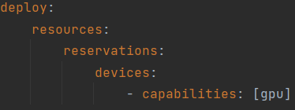
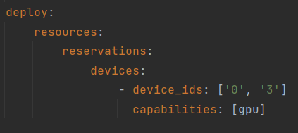

# Backdoor Pony v2

Backdoor Pony allows researchers to test, on a single platform, a wide variety of attacks and defences on different neural network models.
It creates a simulated environment for the attacks and defenses with manipulable parameters, giving the user a full sandbox experiance.
There is a web app GUI that communicates with the backend using REST API.

### List of available attacks and defenses

| Model | Attack                                                                                                                                                                                                       | Defence                                                                                                                                                                              |
|-------|--------------------------------------------------------------------------------------------------------------------------------------------------------------------------------------------------------------|--------------------------------------------------------------------------------------------------------------------------------------------------------------------------------------|
| Image | [Badnet](https://arxiv.org/pdf/1708.06733.pdf) <br/> [Clean Label Badnet](https://people.csail.mit.edu/madry/lab/cleanlabel.pdf) <br/> [Elastic Net](https://arxiv.org/pdf/1412.6572.pdf) <br/> [Deepfool](https://arxiv.org/pdf/1511.04599.pdf) | [Autoencoder](https://ieeexplore.ieee.org/stamp/stamp.jsp?tp=&arnumber=9579062)<br/> [IBAU](https://arxiv.org/pdf/2110.03735.pdf)<br/> [STRIP](https://arxiv.org/pdf/1902.06531.pdf) |
| Audio | [BAASV]()                                                                                                                                                                                                    | [STRIP-VITA](https://arxiv.org/pdf/1911.10312.pdf)                                                                                                                                   |
| Text  | [BadNl](https://arxiv.org/pdf/2006.01043.pdf)                                                                                                                                                                | [ONION](https://arxiv.org/pdf/2011.10369.pdf)                                                                                                                                                                            |
| Graph | [Zaixizhang](https://arxiv.org/pdf/2006.11165v4.pdf)                                                                                                                                                         |                                                                                                                                                                                      |

# Setup the app

---
### Automatic (with Docker)

Assuming docker and docker-compose are installed and in the path.

Open a terminal window (easiest through right-click in Visual Studio Code on README.md --> Open in Integrated Terminal)

```bash
docker-compose up -d
```

Now Docker will build the images (this might take a few minutes but will only be done on the first run) and run them. After this is done you should be able to see the GUI on http://localhost:8080 and the backend on http://localhost:5000

### Manual

#### Start the server

Assuming Python 3.8 is installed and in the path.

Intial setup.

```bash
cd server
python3.8 -m venv env
source env/bin/activate
cd src
pip install -r requirements.txt --ignore-installed
cd backdoorpony
python -m flask run --host=0.0.0.0
```

Concurrent runs.

```bash
cd server
source env/bin/activate
cd src/backdoorpony
python -m flask run --host=0.0.0.0
```

#### Start the GUI

## Getting started
Assuming Node.JS and NPM are installed and in the path.
Initial setup.

```bash
cd gui
npm install
npm run serve
```

Concurrent runs.

```bash
cd gui
npm run serve
```
---
## Running
When nothing was changed in the docker-compose.yml or one of the Dockerfile files
```
docker-compose up -d
```
is sufficient to start the project.
If something has changed in one of these files run the following commands.
```bash
docker-compose down
docker-compose build
docker-compose up -d
```

---
## Test coverage
To get a coverage report for the tests you must attach a shell to the python container and run the following commands.
This will be automated in the pipeline in the near future.
```
cd server
source env/bin/activate
cd src
coverage run --branch -m unittest discover -p test_*.py
coverage report -m
```


## GPU support
GPU support added initially when running a docker-compose file with an existing [pytorch image](https://hub.docker.com/r/pytorch/pytorch) with cuda and nvidia drivers, as specified in the server-side **Dockerfile**

This means that **docker-compose up** will automatically expose **all** available GPUs in the system to the container

The current docker-compose gpu setup is shown on the image below.  



In order to specify device id's, add **device_ids: ['insert_device_id1','insert_device_id2', etc]** to a docker-compose file in devices, before the capabilities.

Here is an example of using the first and the fourth GPUs:



Consult with nvidia-smi to find out how GPUs are identified in your system.

### Changing to a CPU-only mode
In order to run Backdoor Pony v2 in a cpu-only mode, simply remove **deploy>resources>reservations>devices>capabilities: [gpu]** from the docker-compose file(shown on the image above) 


### WSL
When using WSL, there are possible issues due to **nvidia/cuda driver not installed on WSL correctly**(as it is not intended to be used for WSL). This has to be fixed manually depending on the system that is running on WSL, 
so if there are driver issues that cannot be fixed, remove the GPU support as discussed above to use the application.

**Important Notice: Nvidia only added cuda support to WSL 2, running this app on WSL 1 is not possible** 

### Specifying gpus with docker run
When running a container using docker run, --gpus flag can be used to indicate what gpus are exposed to the system(and hence will be used): 
- **--gpus all** can be used to expose all available gpus.
- **--gpus device=specify_device_id_here** can be used to expose only a specific gpu
- **--gpus '"device=comma_separated_ids"'** can be used to expose multiple GPUs. For example. **--gpus '"device=0,2"'** will expose the first and third gpu. Ids must be comma-separated 
  
Any number of gpu, as long as they are compatible with currently used cuda version and the current version of nvidia drivers, can be exposed to the container.

Consult with [docker documentation](https://docs.docker.com/engine/reference/commandline/run/) for more information on devices and setting resource limitations for docker run


# Extension Guide
Adding new datasets, models, classifiers, attacks, defences and metrics is explained in fine detail with examples in the Extension Guide that is located in the project /docs directory.


## Recommendations 
The developing team identified (number of) features that can significantly improve the user experience or the quality of the framework. This section lists and explains such features in order of their priority.

### Custom Datasets 
Currently, only datasets implemented on the server-side can be used to train and test the models, as well as administer poisoning attacks.
For administering attacks, data different from what the classifier can be used and the outcome of an attack(and defence) will be different based on the data used.
Uploading a custom dataset would allow the user to simulate the learning process more accurately, especially if the model is intended to be trained as the data is collected,
and not once.

### Unimplemented features

# Authors
- Oliver Sihlovec
- Kristián Gogora
- Vlad Murgoci
- Nikita Smolin
- Arthur Mercier

# Sources 
Here are links to the repositories we have used in this project.
All code was used with accordance to their respective licenses.

- [Padding Function](https://www.kaggle.com/code/arunmohan003/sentiment-analysis-using-lstm-pytorch/notebook)
- [zaixizhang attack](https://github.com/zaixizhang/graphbackdoor)
- [GTA](https://github.com/HarrialX/GraphBackdoor)
- [Adversial Robustness Toolbox](https://github.com/Trusted-AI/adversarial-robustness-toolbox/tree/main/art)
- [Audio MNIST](https://github.com/Jakobovski/free-spoken-digit-dataset)
- [VGD Dataset](https://dagshub.com/kingabzpro/voice_gender_detection)
- [STRIP-VITA](https://github.com/yjkim721/STRIP-ViTA)
- [I-Bau](https://github.com/YiZeng623/I-BAU)

# License
Copyright  2022  AISyLab

Permission is hereby granted, free of charge, to any person obtaining a copy of this software and associated documentation files (the "Software"),
to deal in the Software without restriction, including without limitation the rights to use, copy, modify, merge, publish, distribute, sublicense,
and/or sell copies of the Software, and to permit persons to whom the Software is furnished to do so, subject to the following conditions:

The above copyright notice and this permission notice shall be included in all copies or substantial portions of the Software.

THE SOFTWARE IS PROVIDED "AS IS", WITHOUT WARRANTY OF ANY KIND, EXPRESS OR IMPLIED, INCLUDING BUT NOT LIMITED TO THE WARRANTIES OF MERCHANTABILITY,
FITNESS FOR A PARTICULAR PURPOSE AND NONINFRINGEMENT. IN NO EVENT SHALL THE AUTHORS OR COPYRIGHT HOLDERS BE LIABLE FOR ANY CLAIM,
DAMAGES OR OTHER LIABILITY, WHETHER IN AN ACTION OF CONTRACT, TORT OR OTHERWISE, ARISING FROM,
OUT OF OR IN CONNECTION WITH THE SOFTWARE OR THE USE OR OTHER DEALINGS IN THE SOFTWARE.